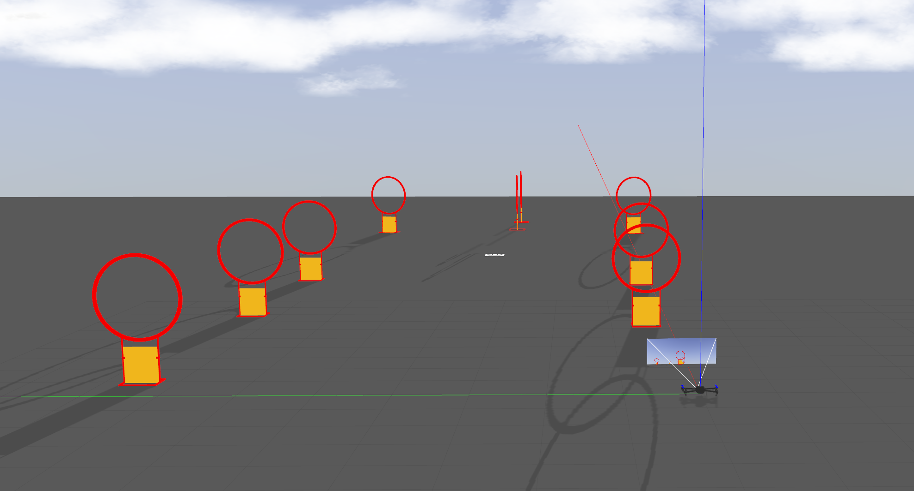

# 环境配置

1、更改 detection 中 cmakelist 中 paddle_inference 的文件位置

2、配置好 PX4 固件之后。把 onboard/src/simulation/competition_sim/models 中的 models 文件拷贝到 ~/.gazebo/models中


``` 
cd onboard
catkin_make
source ./devel/setup.zsh
roslaunch competition_sim sim_with_d435i.launch
```

查看是否可以正确打开仿真环境，并且 mavros 正常运行

如图所示：




```
roslaunch controller AutoFly.launch
```

飞机按照预先指定的路点飞行

TODO:

- [ ] 重新训练新的识别模型，并更改相机参数
- [ ] 相机点云转八叉树，并进行序列滤波，构建局部地图，用于避障
- [ ] 更换规划代码从两点之间的多项式计算方法，转换为自动插补中间路
- [ ] 测试姿态控制的方式是否可行